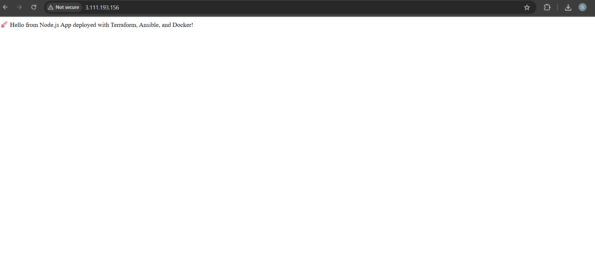

# 🚀 DevOps CI/CD Pipeline for Node.js App

This project demonstrates a complete DevOps pipeline that builds, tests, provisions, configures, and deploys a simple Node.js web application on AWS Free Tier, using tools like Git, GitHub, Docker, Dockerhub, Jenkins, Terraform, and Ansible.

🔗 **GitHub Repo URL**: [https://github.com/Sahil3908/myapp-devops-pipeline.git](https://github.com/Sahil3908/myapp-devops-pipeline.git)
---

## 🧠 Learning Objectives

✅ Apply Git branching and pull request workflows on GitHub  
✅ Containerize a Node.js app and publish to DockerHub  
✅ Provision infrastructure using Terraform (IaaC)  
✅ Configure VMs and deploy containers using Ansible  
✅ Automate the complete CI/CD process using Jenkins pipelines  
✅ Write reusable Bash scripts with error handling and logging  

---

## 🛠️ Tech Stack

- **Node.js** – Web Application  
- **Git & GitHub** – Version Control and Collaboration  
- **Docker & DockerHub** – Containerization  
- **Terraform** – Infrastructure Provisioning on AWS  
- **Ansible** – Configuration Management & App Deployment  
- **Jenkins** – CI/CD Orchestration  
- **AWS EC2 (Free Tier)** – Cloud Hosting  

---

##  Web Application UI

